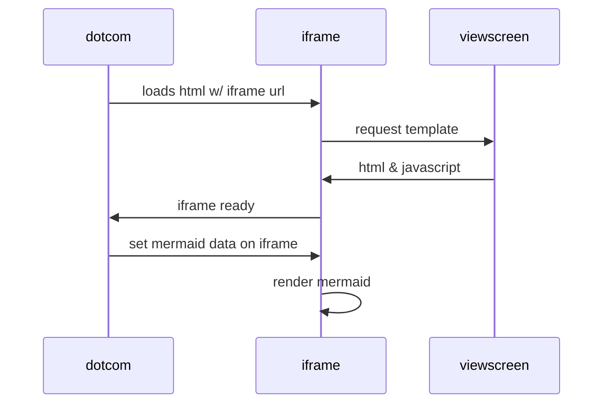

# urban-fortnight

[](https://dev.azure.com/AzCelerium/CeleriumDemo/_build/latest?definitionId=3&branchName=main)
[](https://github.com/Celerium/_CeleriumDemo/actions/workflows/pages/pages-build-deployment)


Just a test repo to better understand Git test


````

````


